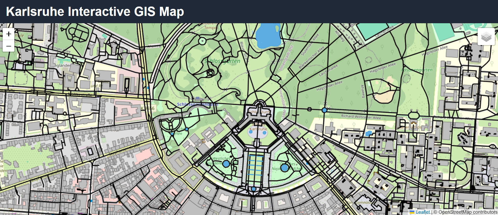
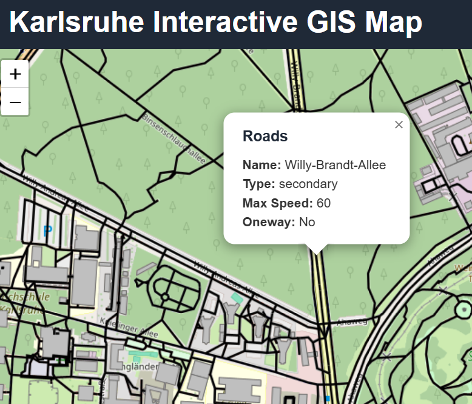
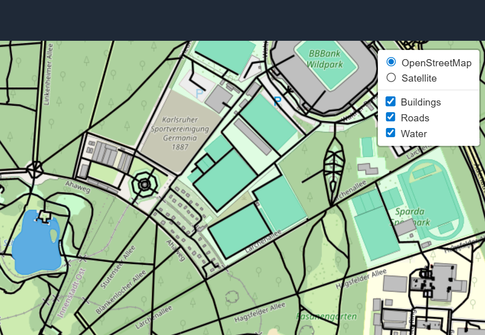

# Karlsruhe Interactive Web Map

Interaktive Webkarte der Region Karlsruhe, entwickelt mit **PostGIS**, **GeoServer** und **Leaflet.js** als vollständiger Open-Source WebGIS-Stack.

Die Anwendung demonstriert die komplette Pipeline von der Geodatenaufbereitung über die räumliche Datenhaltung bis hin zur webbasierten Visualisierung.



## Features

* Interaktive Webkarte für die Region Karlsruhe
* WMS-Layer bereitgestellt über GeoServer
* Räumliche Datenhaltung mit PostgreSQL / PostGIS
* Feature-Popup per Klick (GetFeatureInfo)
* Layer-Steuerung (Ein-/Ausblenden)
* Individuelles Layer-Styling (SLD)
* Reverse Proxy via Nginx (CORS-freundlich)
* Dockerisierte Infrastruktur
* Plattformübergreifend (Windows / macOS / Linux)
* Automatisierter Projektstart per Script

## Tech Stack

| Technologie               | Zweck                                         |
| ------------------------- | --------------------------------------------- |
| GeoServer                 | Bereitstellung räumlicher Dienste (WMS / WFS) |
| PostgreSQL + PostGIS      | Räumliche Datenbank                           |
| Leaflet.js                | Interaktive Kartenvisualisierung              |
| Nginx                     | Reverse Proxy / Webserver                     |
| Docker + Docker Compose   | Containerisierte Bereitstellung               |
| QGIS                      | Geodatenaufbereitung                          |
| OpenStreetMap (Geofabrik) | Quelldaten                                    |

## Datenpipeline

OpenStreetMap (Geofabrik)
↓
QGIS (Filterung / Verarbeitung)
↓
GeoPackage (`karlsruhe.gpkg`)
↓
PostGIS (räumliche Speicherung)
↓
GeoServer (WMS / GetFeatureInfo)
↓
Leaflet Frontend (Webkarte)

## Layer

| Layer     | Typ     | Quelle                    |
| --------- | ------- | ------------------------- |
| Roads     | Linie   | OpenStreetMap / Geofabrik |
| Buildings | Polygon | OpenStreetMap / Geofabrik |
| Water     | Polygon | OpenStreetMap / Geofabrik |

## Projektstruktur

```text
karlsruhe_interactive_webmap/
├── data/
│   └── karlsruhe.gpkg
│
├── docker/
│   └── geoserver/
│       └── data_dir/
│
├── scripts/
│   ├── init-db.bat
│   └── init-db.sh
│
├── web/
│   ├── index.html
│   ├── map.js
│   ├── style.css
│   └── nginx.conf
│
├── screenshots/
│   └── map.png
│
├── docker-compose.yml
├── start.bat
├── start.sh
├── .gitignore
└── README.md
```

## Quick Start

### Voraussetzungen

Installiert sein muss:

* Docker Desktop (Windows / macOS)
* Docker Engine + Docker Compose (Linux)
* Git

---

### Schritt 1 — Repository klonen

```bash
git clone https://github.com/sumon05/karlsruhe_interactive_webmap.git
cd karlsruhe_interactive_webmap
```

---

### Schritt 2 — Projekt starten

#### Windows

```powershell
.\start.bat
```

#### macOS / Linux

```bash
chmod +x start.sh
chmod +x scripts/init-db.sh
chmod -R 777 docker/geoserver/data_dir
./start.sh
```

---

Beim ersten Start wird automatisch:

* PostgreSQL / PostGIS gestartet
* GeoServer gestartet
* Nginx Webserver gestartet
* GeoPackage in PostGIS importiert
* Webanwendung bereitgestellt

Ausgabe:

```text
Starting Karlsruhe WebGIS...
Waiting for database...
Importing GIS data...
Import complete!

---------------------------------------
Map:       http://localhost:8000
GeoServer: http://localhost:8081/geoserver
---------------------------------------
```

---

### Schritt 3 — Karte öffnen

Webkarte:

```text
http://localhost:8000
```

GeoServer Admin Panel:

```text
http://localhost:8081/geoserver
```

Login:

```text
Benutzername: admin
Passwort: geoserver
```

## Architektur
```
Browser (`localhost:8000`)
↓
Nginx Reverse Proxy
↓
GeoServer (`localhost:8081`) ← WMS / GetFeatureInfo
↓
PostGIS (räumliche Datenbank)
↓
GeoPackage Import (`ogr2ogr`)
↓
OpenStreetMap Daten (Geofabrik / QGIS)
```
## Screenshots

### Kartenansicht


### Popup-Informationen



### Layer-Steuerung



## Troubleshooting

### Karte lädt nicht

Prüfen, ob Container laufen:

```bash
docker ps
```

Neustart:

```bash
docker compose down
docker compose up -d
```

---

### Layer werden nicht angezeigt

Datenbank prüfen:

```bash
docker exec -it postgis psql -U postgres -d gis
```

Dann:

```sql
\dt
```

Es sollten folgende Tabellen sichtbar sein:

* roads
* buildings
* water

---

### GeoServer startet unter macOS nicht

Berechtigungen setzen:

```bash
chmod -R 777 docker/geoserver/data_dir
docker compose restart geoserver
```

---

### Port bereits belegt

Folgende Ports müssen frei sein:

* 8000 → Webkarte
* 8081 → GeoServer
* 5432 → PostgreSQL

## Datenquelle

* OpenStreetMap Contributors
* Geofabrik GmbH — https://download.geofabrik.de/

## Lizenz

OpenStreetMap Daten stehen unter der **ODbL License**.

https://www.openstreetmap.org/copyright

## Autor

**Shaikh Shahidul Islam**
GitHub: https://github.com/sumon05
